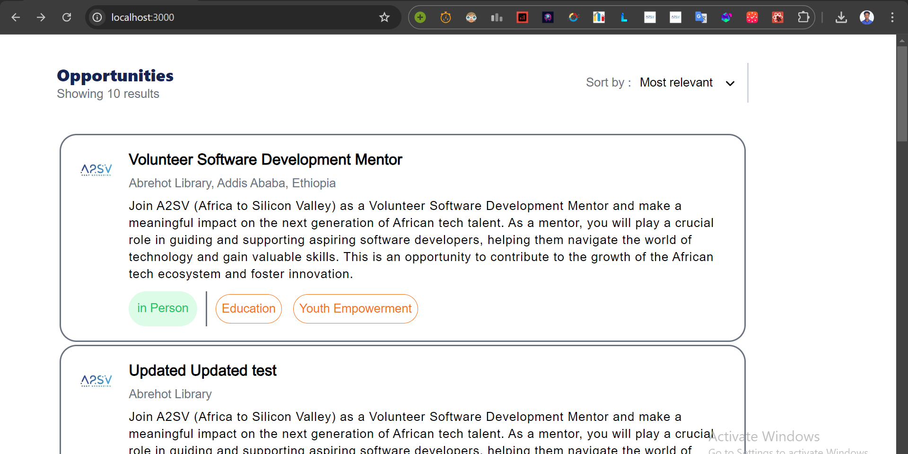
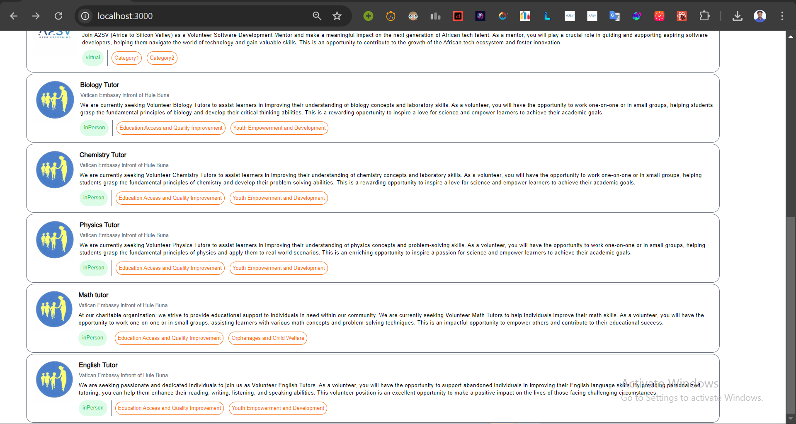
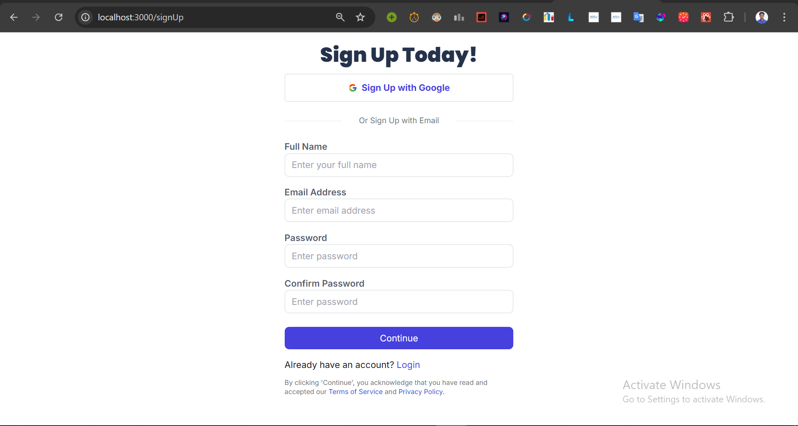
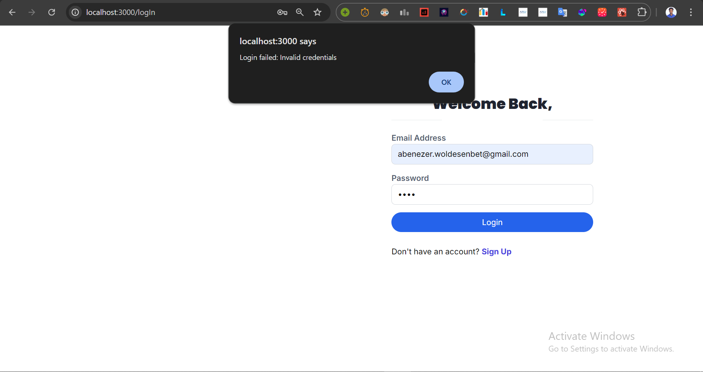
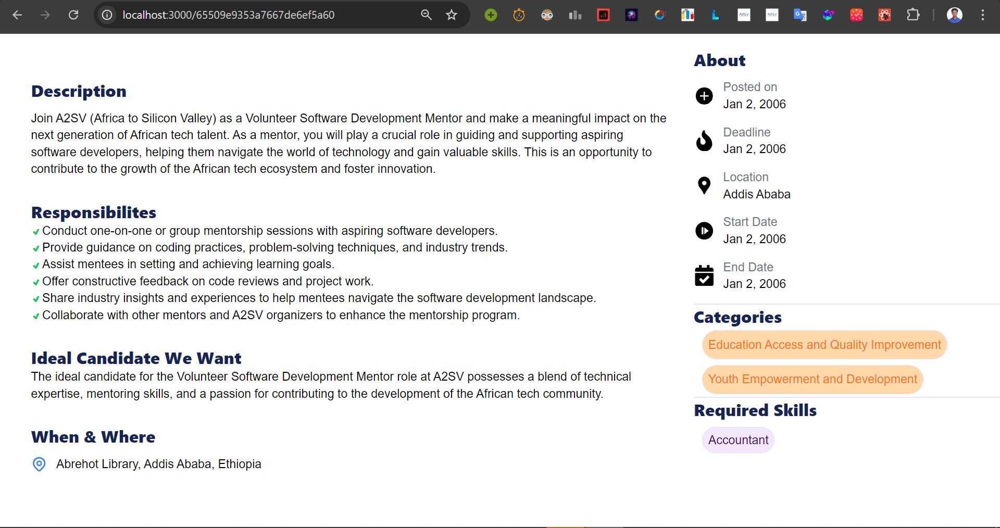
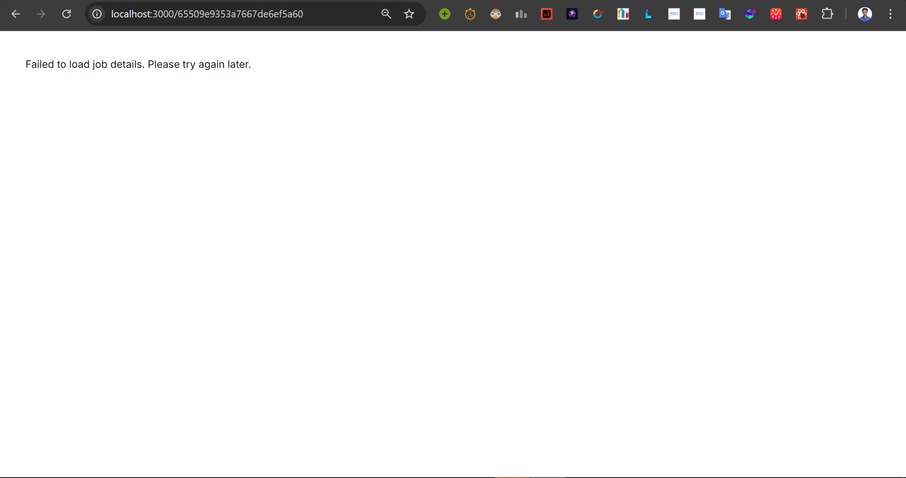

---

# Authentication Implementation with NextAuth

## Objective

Implement authentication functionality in a Next.js application using NextAuth. This includes creating signup and signin pages and integrating them with provided API endpoints for user registration and authentication.

## Steps

1. **Design Signup and Signin Pages:**
   - Create separate pages/components for signup and signin.
   - Design these pages based on the provided UI reference, ensuring usability and accessibility.
   
2. **Implement Signup Logic:**
   - Use the `/signup` endpoint to implement user registration.
   - Capture and send user data (e.g., name, email, password, etc.) via a POST request.
   - Handle server responses, displaying error messages or success notifications as needed.

3. **Implement Signin Logic:**
   - Use the `/login` endpoint to implement user authentication.
   - Capture and send user data (e.g., email, password) via a POST request.
   - On success, securely store the access token for future use. Handle errors gracefully.

## Additional Information

- Ensure secure handling of sensitive data (passwords, access tokens).
- Implement client-side validation to enhance user experience and reduce unnecessary server requests.
- Maintain clean, well-structured code following best practices.

## API Endpoints

- **Base URL:** `https://akil-backend.onrender.com/`
- **Signup:** `/signup` (POST)
- **Verify Email:** `/verify-email` (POST)
- **Sign In:** `/login` (POST)

## Screenshots

### Home Page

The Home Page displays a list of job postings.

**Description**: The Home Page lists all available job postings. Each job card displays the job title, description, type, categories, and an image.
### Sign Up page

### Log in page

### Invalid Log in

### Job Card

A detailed view of an individual job card.

### Applicant Dashboard

**Description**: Each job card includes the organization's logo, job title, location, description, operation type, and categories.

### Faild API Request

Below is a screenshot showing the error message displayed when the API request fails:

---
