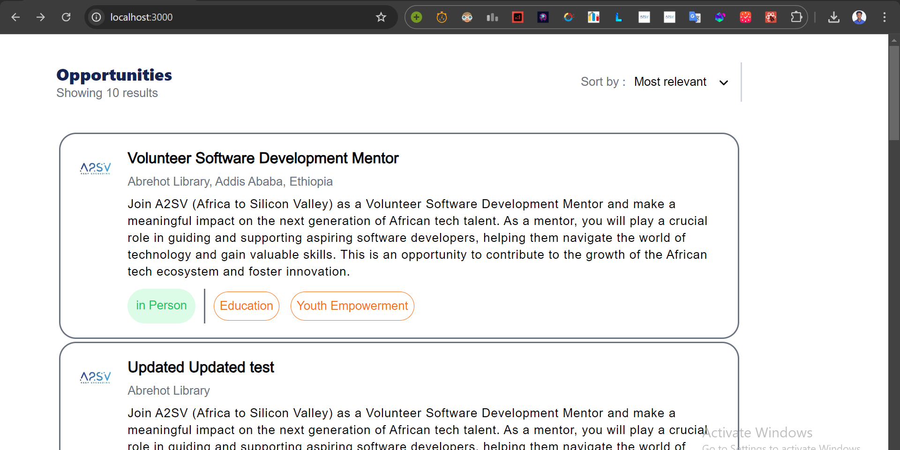
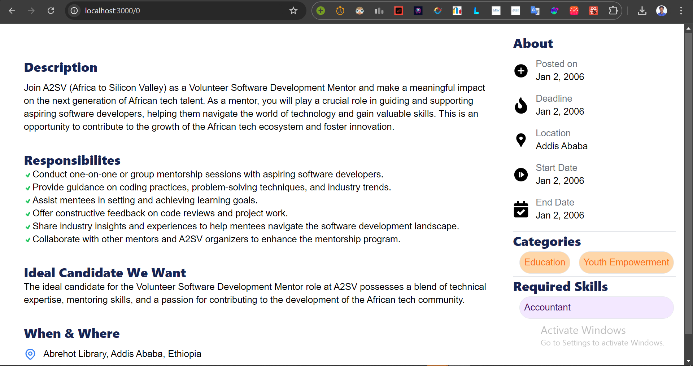

# Job Listing Application

A Next.js application that displays a list of job postings using data from a JSON file.

## Table of Contents

- [Installation](#installation)
- [Usage](#usage)
- [Screenshots](#screenshots)
- [Components](#components)
- [Data](#data)
- [Project Structure](#project-structure)

## Installation

To run this project locally:

1. Clone the repository.
2. Install the dependencies.
3. Run the development server.
4. Open your browser and go to `http://localhost:3000`.

## Usage

To add or update job postings, modify the `jobs.json` file located in the `Data` directory. The application will automatically reflect these changes.

## Screenshots

### Home Page

The Home Page displays a list of job postings.




**Description**: The Home Page lists all available job postings. Each job card displays the job title, description, type, categories, and an image.

### Job Card

A detailed view of an individual job card.


### Applicant Dashboard



**Description**: Each job card includes the organization's logo, job title, location, description, operation type, and categories.

## Components

### Home Page

The `Home` component fetches job data from `jobs.json` and maps through it to display `JobCard` components.

### Job Card

The `JobCard` component displays individual job details.

### Applicant Dashboard

The `Applicant Dashboard` component displays every details of the chosen job.

## Data

The `jobs.json` file contains job posting data used by the application.

## Project Structure

```
.
├── components
│   └── jobCard.tsx
│    └──globals.css
├── pages
│   └── index.tsx
├── public
│   └── 
├──screenshots
│    └── home_page.png
│    └── job_card.png
├── types
│   └── job.ts
├── Data
│   └── jobs.json
├── next.config.js
├── package.json
└── README.md
```
